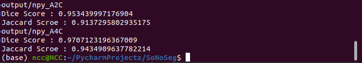

# A2C_A4C_Segmentation 사용법

## Inference code (Only Prediction mode)

## Training & Inference 환경

1. OS(운영체제) : Ubuntu 20.04.2 LTS
2. CPU : Intel Xeon Silver 4216 CPU @ 2.10GHz processor : 64
3. GPU : Quadro GV100 (Memory : 32GB)
4. RAM : 93GB
5. Version : Python 3. 이상
             Pytorch 1.6 이상

## 경로 설명


    SoNoSeg/
    ├── DB
    │   └── Test <- Test 할 데이터 넣을 경로
    │       ├── A2C (*.png) (Evaluation 을 하려면 해당 폴더에 *.npy 이동)
    │       └── A4C (*.png) (Evaluation 을 하려면 해당 폴더에 *.npy 이동)
    ├── DB_nifti
    │   └── Test
    │       ├── Task02_A2C
    │       │   ├── imagesTr
    │       │   ├── imagesTs (*.nii.gz)
    │       │   ├── labelsTr
    │       │   └── dataset.json
    │       └── Task04_A4C
    │           ├── imagesTr
    │           ├── imagesTs (*.nii.gz)
    │           ├── labelsTr
    │           └── dataset.json
    ├── media
    │   └── ncc (User Name)
    │       ├── nnUNet_raw_data_base
    │       │   └── nnUNet_raw_data (Preprocess data)
    │       └── nnunet_trained_models
    │           └── nnUNet
    │               └── 2d
    │                   ├── Task002_A2C (A2C Model)
    │                   └── Task004_A4C (A4C Model)
    ├── nnUNet (Library)
    │
    └── output
        ├── nifti_A2C (*.nii.gz)
        │   
        ├── nifti_A4C (*.nii.gz)
        │
        ├── npy_A2C (*.npy) <- 최종 Output 데이터 경로
        │   
        └── npy_A4C (*.npy) <- 최종 Output 데이터 경로


## 0. 기본환경설정 (Ubuntu)

Ctrl + Alt + t 를 눌러 Command 창 실행


#### Ubuntu 편집기 Nano 설치

```bash
>> sudo apt-get install nano
```

#### 0-1. nnUNet 설치

첨부된 SoNoSeg 압축파일 해제 후 해당 폴더로 이동

예시) `>> cd PycharmProject/SoNoSeg`

해당 폴더 이동 후 다음의 Command 입력

```bash
>> cd nnUNet
>> pip install -e .
```

Inference에 필요한 Library 설치


#### 0-2. Model 및 Inference 등 경로 환경 설정

`>> touch /home/(user_name)/.bashrc`
로 bash 파일 생성 (user_name : 사용자 이름으로 되어있는 경로)


`>> nano /home/(user_name)/.bashrc`

로 파일을 열어서 가장 하단에 다음을 복사하여 붙여넣기

```bash
export nnUNet_raw_data_base="media/ncc/nnUNet_raw_data_base"
export nnUNet_preprocessed="media/ncc/nnUNet_preprocessed"
export RESULTS_FOLDER="media/ncc/nnunet_trained_models"
```
입력 후 Ctrl + x, y(Yes) 를 통해 나가기

`>> source /home/(user_name)/.bashrc`로 실행


## 1. Test(Input) 데이터 Preprocess


예시) `>> cd PycharmProject/SoNoSeg`

위의 예시와같이 압축 풀었던 최상위 폴더로 이동

예시) `>> cd PycharmProject/SoNoSeg/DB/test/A2C`

위와 같은 경로에 각각(A2C, A4C) png형식의 Test 데이터 위치

```bash
>> python 1_preprocess.py
```
위의 명령어를 통해 Input 데이터 형식 변환 및 Inference 에 필요한 메타데이터 생성

test_folder에서 save_folder의 경로로 전처리

`test_folder='DB/test/A2C' -> save_folder='DB_nifti/test/Task02_A2C'`

`test_folder='DB/test/A4C' -> save_folder='DB_nifti/test/Task04_A4C'`


`/SoNoSeg` 에서 밑의 명령 각각(A2C, A4C) 실행

```bash
>> nnUNet_convert_decathlon_task -i DB_nifti/test/Task02_A2C/ -output_task_id 002
>> nnUNet_convert_decathlon_task -i DB_nifti/test/Task04_A4C/ -output_task_id 004
```
- -i : 위에서 전처리 한 경로 (nifti 파일)
- -o : task Num 설정


## 2. Prediction


`/SoNoSeg` 에서 밑의 명령 각각(A2C, A4C) 실행

```bash
>> nnUNet_predict -i media/ncc/nnUNet_raw_data_base/nnUNet_raw_data/Task002_A2C/imagesTs/ -o output/nifti_A2C/ -t 002 -tr nnUNetTrainerV2 -m 2d
>> nnUNet_predict -i media/ncc/nnUNet_raw_data_base/nnUNet_raw_data/Task004_A4C/imagesTs/ -o output/nifti_A4C/ -t 004 -tr nnUNetTrainerV2 -m 2d
```


`output/nifti_A2C(A4C)/` 에 nifti 파일 형식의 Inference 출력


## 3. Postprocess

`/SoNoSeg` 에서 `>> python 2_niftitonpy.py` 실행

Inference 된 output 형식인 nifti 에서 npy 로 변경

* 경로 :

`'output/nifti_A2C' -> 'output/npy_A2C'`

`'output/nifti_A4C' -> 'output/npy_A4C'`


## 4. Score Evaluation (Dice Coefficient Score, Jaccard Index Score)

* 경로
* Test path : `'output/npy_A2C'` (.npy)
* Reference path : `'DB/test/A2C'` (.npy)

! Test path 와 Reference path 의 .npy 이름이 서로 같아야 함


/SoNoSeg 에서 `>> python 3_evaluation.py` 실행



다음과같이 A2C, A4C 에 대한 결과 계산

